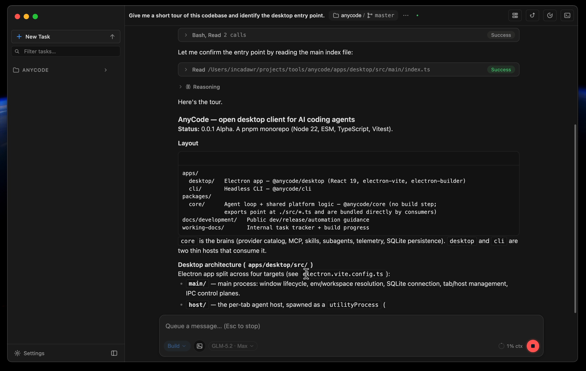

# AnyCode

AnyCode is an open desktop client for AI coding agents. It provides a single
workspace UI for agent sessions: transcript, tool calls, permission requests,
files, terminal commands, context usage, MCP servers, skills, subagents, and
Git review.

## Status

AnyCode is at **0.0.1 Alpha**. APIs, storage, and UI may change without
backward-compatibility guarantees.

Manual end-to-end validation has so far covered only Z.AI (GLM). Anthropic and
custom Anthropic-compatible endpoints are supported in the configuration model,
but require further practical validation before they are release-ready.

## Demo



## Download

Installers for macOS, Windows, and Linux are published on the
[Releases](https://github.com/incadawr/anycode/releases) page.

Alpha builds are not code-signed; signing arrives with the beta. Until then the
operating system asks you to confirm the first launch:

- **Windows** — SmartScreen reports an unknown publisher: **More info → Run
  anyway**.
- **macOS** — the first launch is refused: open **System Settings → Privacy &
  Security**, find AnyCode near the bottom, and press **Open Anyway**.

## Repository layout

- `apps/desktop` — Electron desktop application.
- `apps/cli` — command-line interface.
- `packages/core` — agent loop and shared platform logic.
- `docs/development` — public development, automation, and release guidance.

## Getting started

Requirements: Node.js 22 or newer and pnpm 10.

```bash
pnpm install --frozen-lockfile
pnpm --filter @anycode/desktop dev
```

Configure a provider in the application, or supply the relevant environment
variables for local development, such as `ANYCODE_API_KEY`, `ANYCODE_MODEL`,
and `ANYCODE_BASE_URL`.

## Verification

```bash
pnpm -w typecheck
pnpm test
pnpm --filter @anycode/desktop build
```

The development-only GUI automation boundary and smoke workflow are documented
in [Automation smoke](docs/development/automation-smoke.md). See the
[release policy](docs/development/release.md) for versioning and release
procedure, and [CHANGELOG.md](CHANGELOG.md) for user-facing changes.

## Roadmap and contribution guidance

[ROADMAP.md](ROADMAP.md) describes direction and planned harness profiles.
Repository conventions for agents are in [AGENTS.md](AGENTS.md).

## Contributing

Contributions and feedback are welcome. Please read
[CONTRIBUTING.md](CONTRIBUTING.md) before opening an issue or pull request.
For security vulnerabilities, use the private reporting process in
[SECURITY.md](SECURITY.md).

## License

AnyCode is licensed under the [Apache License 2.0](LICENSE).
