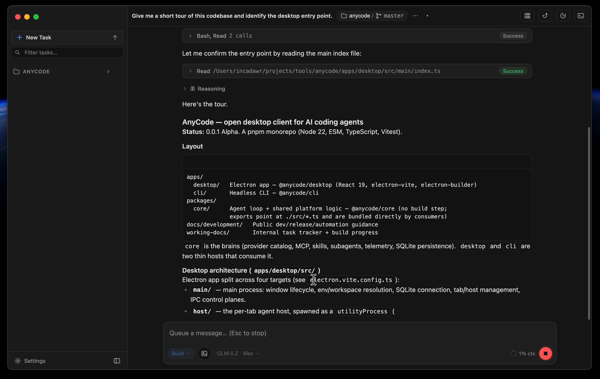

# AnyCode

 

**One desktop workspace over several AI coding agents.** Run a session on the
Claude Code CLI, on the Codex CLI, or on AnyCode's own multi-provider agent
loop — and get the same workspace either way: transcript, tool calls,
permission prompts, file actions, terminal, context usage, MCP servers, skills,
subagents, and Git review.

AnyCode is not another agent — it is the shell around the agents you already run.

**Bring your own agent.** A profile launches an agent CLI you already installed
and are entitled to use, under your own account and your own provider's terms.
AnyCode neither stores nor proxies its credentials — the process runs on your
machine.

**How it differs from other agent desktops** (Conductor, Superset, vendor
GUIs): one shell over *several* engines rather than one vendor's runtime;
subagents can run on a different engine than their parent session; the CLI
adapters are pinned against recorded protocol fixtures, so engine drift fails
the build instead of your session; and a sandboxed preview window the agent
drives itself (open a page, read its console, take a screenshot).

**Your keys stay yours.** Provider credentials live in the OS keychain through
Electron's `safeStorage`, never in plaintext on disk — on Linux without a
keychain, weak storage is refused unless you explicitly opt in. Decrypted
values never leave the main process.



## Engine profiles

| Profile | What runs the session | What it adds |
|---|---|---|
| **Claude Code** | The official Claude Code CLI, headless stream | Image attachments, reasoning effort, context meter, permission modes |
| **Codex** | The OpenAI Codex CLI over its `app-server` protocol | Account profiles, quotas and plan panel, session import, managed binary |
| **Native** | AnyCode's own agent loop | Anthropic, Z.AI (GLM), OpenAI, OpenRouter, DeepSeek, Moonshot, Kimi, and any OpenAI- or Anthropic-compatible endpoint, local ones included |

Capabilities follow the engine. Each profile exposes what its backend actually
supports, and an action the backend cannot perform is disabled rather than shown
as working.

Subagents are not bound to the engine running the session. An agent profile
can pin its children to the Codex or the Claude Code CLI, so a Native session
can hand a task to a different agent and receive the result in the same
transcript.

What a session produces can be looked at without leaving the workspace. A local
markdown or HTML file opens in a preview — a panel beside the transcript or a
window of its own — and the agent can drive that preview itself: open a page,
read back its text and console, take a screenshot of it. Previews are sandboxed,
fetch nothing from the network on their own, and obey the same consent model as
every other file action.

Both CLI profiles are pinned against recorded protocol fixtures: the adapters
have to stay in sync with the recorded streams, so a change on our side that
drops or invents a wire message fails the build rather than surfacing as a
broken session. Re-checking a pin against a freshly released CLI is a separate
opt-in run against the real binary, not part of the default suite.

## Status

AnyCode is **0.0.22, alpha**. Storage, APIs, and UI may change without
backward-compatibility guarantees, and alpha builds are unsigned — signing
arrives with the beta.

How far validation has gone: the Codex and Claude Code profiles are covered by
protocol fixtures and live smoke runs. On the Native profile, end-to-end use has
covered Z.AI (GLM) and Kimi; the remaining providers are supported by the
configuration model but have seen less practical use.

Right now the most valuable contribution is a bug report from real use: a
broken session, a workflow that doesn't fit, a provider that misbehaves —
[open an issue](https://github.com/incadawr/anycode/issues).

## Download

Installers for macOS, Windows, and Linux are on the
[Releases](https://github.com/incadawr/anycode/releases) page.

Because alpha builds are unsigned, the first launch needs one confirmation:

- **Windows** — SmartScreen reports an unknown publisher: **More info → Run
  anyway**.
- **macOS** — the first launch is refused: open **System Settings → Privacy &
  Security**, find AnyCode near the bottom, and press **Open Anyway**.

## Getting started from source

Requirements: Node.js 22 or newer and pnpm 10.

```bash
pnpm install --frozen-lockfile
pnpm --filter @anycode/desktop dev
```

Configure a provider in the application, or, for local development, supply
`ANYCODE_API_KEY`, `ANYCODE_MODEL`, and `ANYCODE_BASE_URL`.

## Verification

```bash
pnpm -w typecheck
pnpm test
pnpm --filter @anycode/desktop build
```

The development-only GUI automation boundary and smoke workflow are documented
in [Automation smoke](docs/development/automation-smoke.md). See the
[release policy](docs/development/release.md) for versioning and release
procedure, and [CHANGELOG.md](CHANGELOG.md) for user-facing changes.

## Repository layout

- `apps/desktop` — the Electron application.
- `apps/cli` — the command-line interface.
- `packages/core` — the agent loop and shared platform logic.
- `docs/development` — public development, automation, and release guidance.

## Roadmap and contribution guidance

[ROADMAP.md](ROADMAP.md) describes the direction. Repository conventions for
agents are in [AGENTS.md](AGENTS.md).

Contributions and feedback are welcome — please read
[CONTRIBUTING.md](CONTRIBUTING.md) before opening an issue or a pull request.
For security vulnerabilities, use the private reporting process in
[SECURITY.md](SECURITY.md).

## License

AnyCode is licensed under the [Apache License 2.0](LICENSE).

«AnyCode» and the AnyCode logo are trademarks of Evgenii Dubov. The Apache 2.0
license covers the code, not the name — forks must use a different name.
