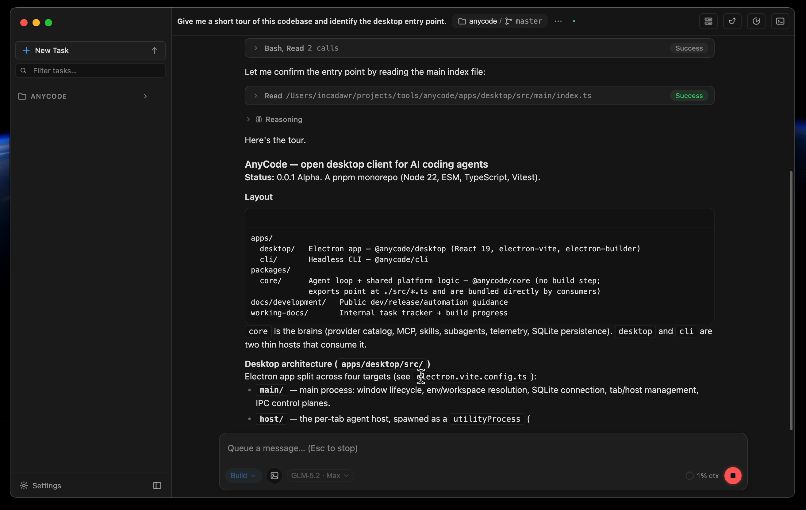

<!-- _class: lead -->

# Один интерфейс. <span class="accent">Любой агент.</span>

**AnyCode** объединяет Claude Code, Codex и собственный multi-provider runtime в одном desktop-пространстве.

`v0.0.8 · alpha`

---

## Агентов стало много. <span class="accent">Рабочее место всё ещё одно.</span>

| Разные окна | Разные правила | Разорванный поток |
|---|---|---|
| У каждого агента — свой интерфейс, история и способ показывать работу. | Права, режимы, контекст и подтверждения приходится изучать заново. | Переключение движка означает потерю привычного workspace и контроля. |

> AnyCode — не ещё один агент. Это оболочка вокруг агентов, которыми вы уже пользуетесь.

---

## Выбирайте <span class="accent">движок</span> под задачу

| Native | Codex | Claude Code |
|---|---|---|
| Собственный agent loop | Официальный Codex CLI | Официальный Claude Code CLI |
| Anthropic, Z.AI, OpenAI, OpenRouter, DeepSeek, Moonshot, Kimi и совместимые endpoints | Аккаунты, квоты, plan, import и managed binary | Reasoning, tools, images, permissions и resume |
| **Multi-provider + local models** | **Bring your own account** | **Bring your own account · early** |

Интерфейс, проект и прозрачность работы остаются прежними.

---

<!-- _class: product -->

## Вся работа агента — <span class="accent">в одном потоке</span>



---

## Тонкая оболочка. <span class="accent">Сменные движки.</span>

```text
┌──────────────────────┐       ┌──────────────────────┐       ┌──────────────────────┐
│      RENDERER        │       │    HOST PER TAB      │       │       ENGINE         │
│                      │       │                      │       │                      │
│ transcript · tools   │ ───▶  │ utilityProcess       │ ───▶  │ Native runtime       │
│ permissions · ctx    │       │ MessagePort stream   │       │ Codex CLI            │
│ terminal · Git       │       │ crash boundary       │       │ Claude Code CLI      │
└──────────────────────┘       └──────────────────────┘       └──────────────────────┘
```

**UI не зависит от того, какой backend произвёл событие.** Возможности включаются честно — только если движок их поддерживает.

---

## Один workspace. <span class="accent">Одинаковый контроль.</span>

| Поверхность | Что получает пользователь |
|---|---|
| **Transcript + tools** | Ответ, reasoning и действия в одной читаемой истории |
| **Permissions + context** | Явные подтверждения, режимы доступа, context meter и квоты |
| **Terminal + Git review** | Команды, файлы и diff рядом с диалогом |
| **MCP + skills** | Расширение среды без привязки к одному вендору |
| **Subagents** | Дочерний агент может работать на другом движке и модели |
| **Artifacts** | Изображения и созданные файлы прямо в сессии |

---

## Безопасность — <span class="mint">архитектура, не настройка</span>

- **Credentials остаются локально.** CLI-профили работают под вашим аккаунтом; AnyCode не проксирует их токены.
- **Renderer отделён от Node и секретов.** У каждой вкладки — собственный host-процесс.
- **Capabilities не симулируются.** Неподдерживаемое действие отключено, а не показано как рабочее.
- **CLI-адаптеры проверяются fixtures.** Изменение протокола не должно тихо терять или придумывать события.
- **Permission flow видим.** Рискованные действия требуют осознанного режима или подтверждения.

> Агент работает рядом с кодом. Контроль над машиной остаётся у пользователя.

---

<!-- _class: lead -->

# Alpha уже работает. <span class="accent">Следующий шаг — экосистема.</span>

- Universal preview для Markdown, изображений, diff и локальных web-приложений
- First-class MCP: статусы, OAuth, tool discovery и управление серверами
- Переключение движка внутри живой сессии
- Multi-agent orchestration и checkpoints

**3 движка · macOS / Windows / Linux · Apache-2.0**

<span class="small">github.com/incadawr/anycode · github.com/incadawr/anycode/releases</span>
